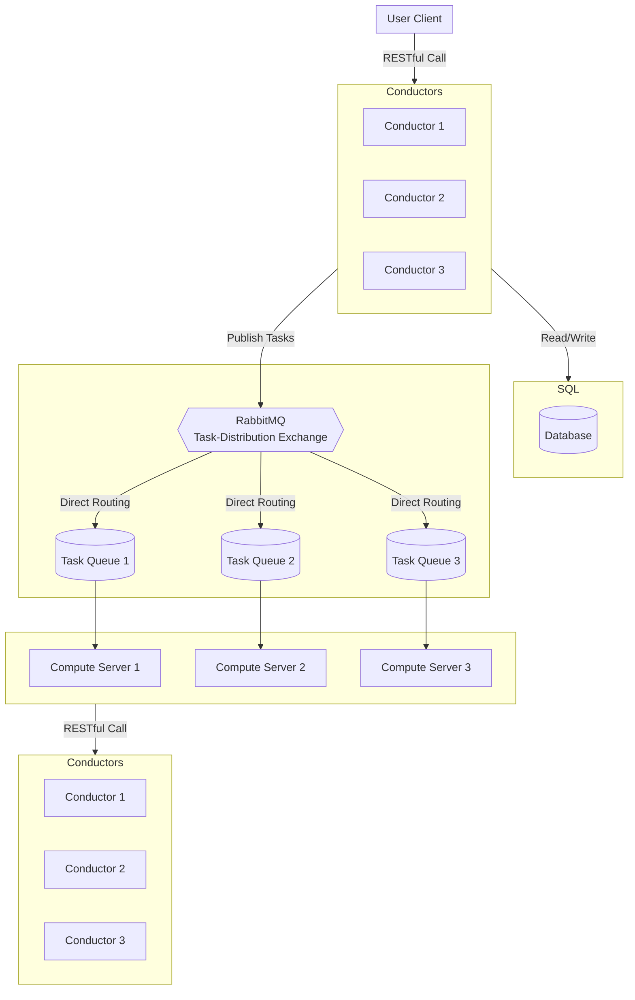
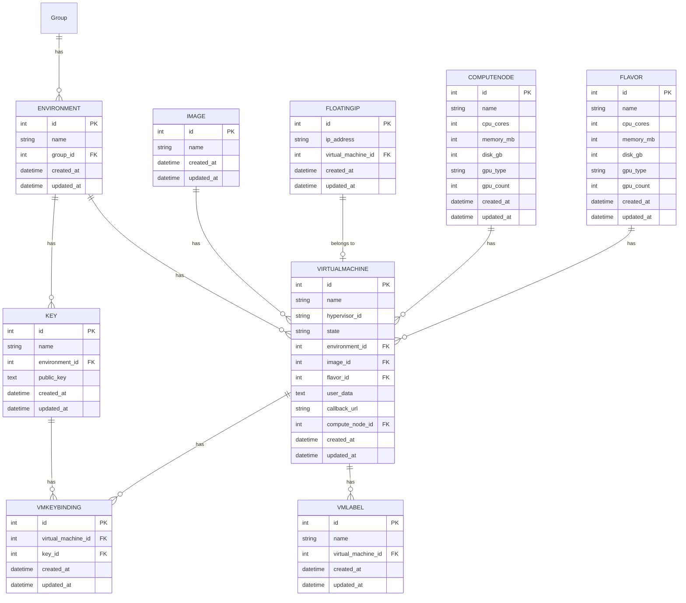

# Solution to Tech Test for Architect Role at Nexgen

This repository contains a solution to the take-home technical test for the Architect role at Nexgen Cloud. The test is designed to _evaluate skills in both high-level design and practical implementation of an API to manage virtual machines (VMs)_.

## State of the Art

The Nexgen's Infrahub API is a RESTful interface that enables users to create and delete VMs, as well as retrieve information about them. It's similar to the OpenStack Compute API, but also differs in significant ways.

One notable improvement over the OpenStack Compute API is that the Infrahub API introduces the `callback_url` field, which allows the user to provide a webhook for notifications about status changes of VMs. This is a valuable feature for enterprise users who want to be notified when their VMs are created or deleted without the need to poll the API for updates.

While the details of the Hyperstack/Infrahub architecture aren't public, the platform is presumably implemented as a service that talks to a database and to the OpenStack Nova API. The OpenStack Nova architecture, however, is publicly documented and consists of several components, including the API server, the scheduler, the conductor, and the compute nodes.

<details>
<summary>Click here to reveal a diagram of the OpenStack Nova architecture</summary>

#####

Note: diagram obtained from the OpenStack's documentation


</details>

The Infrahub API RESTful calls for creating and deleting VMs are listed below.

| Action      | Method | Endpoint URL                        |
|-------------|--------|-------------------------------------|
| Create a VM | POST   | `/v1/core/virtual-machines`         |
| Delete a VM | DELETE | `/v1/core/virtual-machines/{id}`    |


<details>
<summary>Click here to reveal the payload of the POST call above</summary>

##### Create a VM

Note: the fields from `name` to `count` are required, and the rest are optional.

```json
{
  "name": "test-virtual-machine",
  "environment_name": "test1",
  "image_name": "Ubuntu Server 22.04 LTS",
  "key_name": "test-key",
  "flavor_name": "n3-RTX-A6000x1",
  "count": 1,
  "volume_name": "string",
  "create_bootable_volume": false,
  "user_data": "string",
  "callback_url": "string",
  "assign_floating_ip": false,
  "security_rules": [{...}],
  "profile": {...},
  "labels": [
    "string"
  ]
}
```

</details>

## Part 1: High-Level Design

The described solution is an extension of Nexgen's existing Infrahub API. The extensions enhance the end-user experience, with a special focus on enterprise users.

### Enhancement 1: Associate Multiple Keys With a VM

The Infrahub API currently allows users to associate only one key with a VM. This limitation is problematic for enterprise users who need to grant multiple users access to a VM. As a workaround, users can place multiple keys in a single key object, but this approach can be confusing. A more intuitive solution would be to allow users to associate multiple keys with a VM directly. The proposed solution enables this by allowing users to provide a list of key names in the key_names field of the payload.

### Enhancement 2: Identify by Resource Name Within Org and Env

Currently, users are assigned VM IDs automatically by the Infrahub API, which may be inconvenient for some users. Some enterprise systems may prefer to rely on some internal naming scheme. While the Infrahub API allows the user to use a custom name for a VM, it doesn't allow to make operations on VMs based on the name. That leaves the user with two options:

* Make two calls to the Infrahub API: one to retrieve the list of all VMs, find the correct VM ID based on the name then make the call to make the change to the VM. This is problematic with some workflow systems that work best if an operation is performed with a single API call (for example, an Argo Rollouts step).

* Track the VM ID in their own database, which puts an extra burden on the user.

One way to solve it on the Nexgen side would be to provide a GraphQL API that allows to combine the call to retrieve the VM ID and make the change to the VM in a single call. A GraphQL API might be useful for other use cases as well, such as retrieving multiple VMs based on a filter. However, since this task explicitly asks for a RESTful API, I will not consider this solution.

Another solution is to:

* Enforce that a VM's `name` is unique within an organization and environment

* Make `name` an optional field in the RESTful call for creating VMs. If the user doesn't provide the name, have the system assign a unique memorable name (similar to how Docker assigns names to containers). This is useful for users who don't have a naming scheme.

* If the user provides a `name` and a `count` greater than 1, have the system assign names based on the provided name and a number (e.g., `test-vm-1`, `test-vm-2`, etc.)

* Allow the user to identify a VM by `name` and `environment` in the RESTful calls for mutating VMs (the organization is already defined by the user's API key)

* Allow the user to identify VMs by `label` and `environment` to perform operations on multiple VMs at once

I'm therefore proposing new endpoints for mutating VMs:

* `/v1/core/virtual-machines/{env}/{name}`

* `/v1/core/virtual-machines/{env}/{label}`

However, given that the task is limited to a few hours' effort, I'm not going to implement them.

### Enhancement 3: GitOps Integration for Declarative VM Management

The current Infrahub API is imperative, just like the OpenStack API, meaning that the user communicates with the system using verbs such as `create` or `delete`. In other words, the user specifies the steps required to change the state of the system. However, many users prefer to describe the desired state of the system and have the system figure out automatically how to reach that state. This is known as declarative management.

Ideally, users would describe the desired state of their infrastructure using a text file stored in a source-code repository. The system would then automatically reconcile the actual state of the infrastructure with the desired state, creating or deleting VMs as necessary. This would also allow users to track changes to their infrastructure over time, review them, and roll them back if necessary.

One way to achieve this would be to create a Terraform provider for the Infrahub API. Terraform is a popular tool for managing infrastructure as code in a declarative way. The Terraform provider would translate the Terraform configuration into calls to the Infrahub API.

However, Terraform introduces the additional complexity for the user: having to manage the Terraform state. This could be avoided if the Infrahub API itself supported declarative management. This would allow users to describe the desired state of their infrastructure in a declarative way using a YAML file stored in Git, and the Infrahub API would automatically reconcile the actual state of the infrastructure with the desired state.

I am therefore proposing a new endpoint called `/gitops/git-repo` that allows to register a new git repository with the platform, which will be monitored for changes. In addition, users will be able to configure their source code management system (such as GitHub) to send notifications about changes to the repository to a webhook: `/gitops/git-repo/{id}/github-webhook`. When a change is detected, the Infrahub API will automatically reconcile the actual state of the infrastructure with the desired state described in the YAML files in the repository.

However, given the limited time for this task, I will not implement the GitOps integration.

### API Design

The final API design is as follows:

| Action       | Method | Endpoint URL                        |
|--------------|--------|-------------------------------------|
| Create VMs   | POST   | `/v1/core/virtual-machines`         |
| Delete a VM  | DELETE | `/v1/core/virtual-machines/{id}`    |

<details>
<summary>Click here to reveal the payload of the POST call above</summary>

##### Create a VM

Note: the fields from `environment_name` to `count` are required, and the rest are optional.

```json
{
  "name": "string",
  "environment_name": "test1",
  "image_name": "Ubuntu Server 22.04 LTS",
  "key_names": [
    "test-key1",
    "test-key2"
  ],
  "flavor_name": "n3-RTX-A6000x1",
  "labels": [
    "string"
  ],
  "assign_floating_ip": false,
  "count": 1, /* not implemented */
  "volume_name": "string", /* not implemented */
  "create_bootable_volume": false, /* not implemented */
  "user_data": "string", /* not implemented */
  "callback_url": "string", /* not implemented */
  "security_rules": [{...}], /* not implemented */
  "profile": {...} /* not implemented */
}
```

</details>

### Architecture Diagram

The architecture diagram below shows the proposed architecture for the solution with the new features. For the purpose of this exercise, and in order to be able to implement it in the limited time frame, I have simplified the system at the expense of scalability and security. The OpenStack's Conductor, Scheduler, API Server have been combined into a single monolithic Conductor. The Conductor is responsible for reading and writing to the database and publishing tasks to the RabbitMQ exchange. The Compute Servers are responsible for creating and deleting VMs. The Compute Servers also notify the Conductor about the status of the tasks.



### Database Schema

[Click here to view the database schema in source code](./svcs/models.py)



## Part 2: Technical Implementation

I chose to implement the Conductor's REST API using asynchronous operations, as it benefits significantly from the performance improvements of asynchronicity. In contrast, the Compute Servers are implemented using synchronous logic because they handle minimal traffic, making asynchronous operations unnecessary. The synchronous approach is quicker to develop and easier to maintain, which helps reduce development time.

### Conductor

The Conductor is built using Django, selected for its "batteries included" philosophy, which provides essential features such as a REST framework, ORM, admin interface, and built-in authentication system. Django is widely used, well-documented, mature, stable, and supported by a large developer community. Additionally, Django’s support for asynchronous APIs improves performance in I/O-bound tasks.

The Conductor's API is implemented with the Asynchronous Django REST Framework (ADRF). However, during development, I encountered limitations in ADRF's documentation, which required me to explore its source code for proper usage. In hindsight, django-ninja might have been a better option. Django-ninja is another asynchronous REST framework that appears more mature, utilizes modern Python type hints, and integrates seamlessly with Django. It draws inspiration from FastAPI and shares many of its features while directly integrating with Django.

An alternative approach could have been using the FastAPI/SQLAlchemy/Pydantic stack, which is asynchronous by design. Although popular, this stack lacks Django's all-in-one approach and requires more integration work. Some sources suggest it is faster than Django's async support, but this would need testing, especially as Django's asynchronous capabilities continue to evolve.

The Conductor’s RabbitMQ interactions are handled using the asynchronous `aio-pika` library.

Simple token-based authentication has been implemented using Django's built-in `TokenAuthentication`.

Please note that certain features typically found in production systems, such as authorization, dead-letter queue, and integration tests, have been omitted from this implementation of the Conductor.

### Compute Servers

The Compute Servers do not have a REST API; they only listen for RabbitMQ messages. These servers are implemented using the synchronous `pika` library and are run as separate processes via Django management commands.

### Running the Code

To install dependencies:

```sh
poetry install
```

To run the unit tests:

```sh
poetry run python3 manage.py test
```

To run the entire system in a development environment, you can use Docker Compose:

```sh
# Start the services
docker-compose up --build --scale compute=2

# On a different terminal, populate the test database
docker-compose exec conductor /bin/bash
poetry run python3 manage.py populate_test_db

# Create a VM
curl -X POST http://localhost:8000/v1/core/virtual-machines/ \
  -H "Authorization: Token test_token" \
  -H "Content-Type: application/json" \
  -d '{
    "environment_name": "TestEnv",
    "image_name": "TestImage",
    "flavor_name": "TestFlavor",
    "key_names": ["TestKey"],
    "assign_floating_ip": true,
    "name": "TestStandardVM2",
    "labels": ["TestStandardLabel"]
  }' > ../output.html

# Check the database
docker-compose exec db /bin/bash
psql -U postgres -c "select * from svcs_virtualmachine;"
psql -U postgres -c "select * from svcs_floatingip;"
psql -U postgres -c "select * from svcs_vmlabel;"
psql -U postgres -c "select * from svcs_vmkeybinding;"

# Delete the VM
curl -X DELETE http://localhost:8000/v1/core/virtual-machines/2/ \
  -H "Authorization: Token test_token" \
  > ../output.html
```
